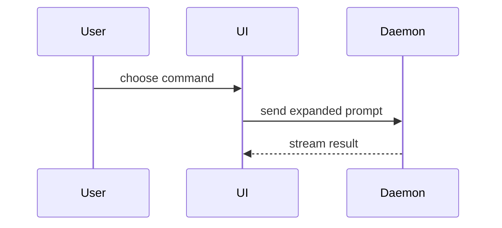

Use this template for writing the PR body:

```markdown
## Summary

<diagram, diff-sketch, or tree>

## Evidence

- **Before:** <screenshot/output/failing test run>
  **After:** <screenshot/output/passing test run>

## Merge Danger

**Door:** <one-way or two-way>

<optional: description>

**Blast Radius:** <one-word description>

<optional: potential ramifications of merge>

## References

- <issue tracker reference, or N/A>
```

An existing body or repository template takes precedence over this template:

1. If the user supplied an existing body to revise, revise that body. Preserve its meaningful headings and order.
2. Otherwise inspect repository PR templates. Use the explicitly requested template, the sole template, or a clearly applicable template. If several templates fit and none is clearly selected, ask the user to choose; do not guess.
3. With no applicable template, use the template above.
4. Treat headings with equivalent meaning as present (for example, `Description` for summary, `Testing` for evidence, `Risks` for merge danger, or `Links` for references). Fill that heading rather than adding a duplicate section. Preserve retained heading text and order; append only semantically absent sections from the template above.

## Sections

Skip all preambles and keep prose brief. Use the user's domain language from `GLOSSARY.md`.

Keep the evidence roles separate:

- The task or conversation establishes intent.
- The branch diff establishes the actual change.
- Commits provide supporting context, not proof.
- Completed observed command, test, or review results establish verification.

### Summary

Pick the smallest view that makes the key point clear.

- Show logic or an algorithm as pseudocode:

```text
on(save)
  if content is unchanged
    return cached result
  write new content
  return fresh result
```

- Show runtime control flow as a call tree:

```text
submitForm
  createSession
    persistPrompt
    launchAgent
  navigateToSession
```

- Show UI structure as a component tree, including state and module boundaries that matter:

```text
<SessionPage> (apps/example/src/routes/session.tsx)
  useSessionEvents()
  <SessionToolbar>
    <RunSkillButton> (packages/ui)
```

- Show file responsibility or a broad refactor as a shallow file tree:

```text
src/
├── commands/       # parses user actions
├── sessions/       # owns session state
└── transport/      # sends API requests
```

- Show component interaction, control flow, or data flow with Mermaid:



- Use `diff` when the point is what changes and the surrounding shape already exists. Match the diff shape to the topic.

For a component change:

```diff
 <SessionPage>
   useSessionEvents()
   <SessionToolbar>
+    <RunSkillButton />
   <SessionTimeline>
+    <SkillResultCard />
```

For a file-layout change:

```diff
 src/
 ├── commands/
+│   └── show-me.ts       # expands the slash command
 ├── sessions/
-└── transport.ts
+└── transport/
+    ├── client.ts
+    └── stream.ts
```

For a call-tree or call-stack change:

```diff
 submitForm
   createSession
     persistPrompt
+    expandSkillMention
     launchAgent
-  navigateToSession
+  navigateToSession
+    subscribeToEvents
```

For a state or control-flow change:

```diff
 on(save)
-  write content
+  if content is unchanged
+    return cached result
+  write new content
+  invalidate cache
```

- Show the whole block when most of it is new, when omitted context would hide ownership or order, or when the user needs a copyable target shape:

```ts
function expandSkill(command: string): string {
  const skillName = command.slice(1);
  return `use the ${skillName} skill`;
}
```

#### Guidance

Place each visual next to the short text it supports. Keep only the calls, files, props, states, and boundaries needed to answer the user's current question or the options to resolve the current discussion point.

You may use one of these, you may use several, it is unlikely you will use all of them. Use your judgement and don't overwhelm the user.

Every Summary carries at least one visual, including the summary-equivalent heading of a supplied body or repository template. Write the short text beside a visual as concise, ordinary change bullets unless a repository convention requires labels.

#### Reviewer help

- Link one companion PR when work spans repositories; keep its details there.
- For a large or mechanical diff, add a short Reviewer Guide: where to start, behavioral risk, one representative bulk file, then docs/tests.
- Put secondary rationale, long enumerations, and extended verification in `<details>` only when they would bury essential content; keep merge-critical content visible.

### Evidence

Concrete evidence that the change works. Show a before and after.

Screenshots are S-tier - when the environment is set up for it and the change is visual.

Execution-based evidence is A-tier. Test results, console output. Show the exact test that now fails and passes, using pseudocode.

Draw before and after only from completed, observed results. When required proof is unavailable, write `<MISSING_EVIDENCE>` exactly in its place.

#### UI media routing

For a user-visible UI change, route to `before-and-after` only when the user requests screenshot or recording evidence, or asks for a review-ready published PR. Draft or revise the body first; `before-and-after` coordinates the visual-evidence workflow and owns media attachment, while `agent-browser` owns capture mechanics.

- New PR: draft the body → `gh` creates the PR → `before-and-after` adds the media.
- Existing PR: revise the body if needed, then hand the PR to `before-and-after`; do not create another PR.
- A body-only UI request does not authorize capture or publication. Preserve supplied media references without capturing or publishing media.
- Backend or otherwise non-visible changes do not route to `before-and-after`.

### Merge Danger

Describe whether it's a one-way or two-way door. You can walk back through two-way doors, but not one-way doors. A PR that is cheap to roll back is lower risk. Changes that involve destructive actions or hard-to-reverse decisions are one-way doors.

The blast radius is the potential impact or scope of the changes introduced by this PR. Consider all possibilities. Examples are layout shift, breakages for consumers, mobile responsiveness, etc.

Keep it brief, and name the concrete irreversible or rollout risk when one exists.

### References

Discover references in this order: supplied or current body, task or conversation, branch name, commits, then explicit companion-change evidence. Keep only directly relevant references, primary first; templates and placeholders are not references. Preserve supplied URLs exactly; render a plain supplied key without inventing a URL or placeholder (for example, `- ACME-42`). When no issue tracker reference exists, write `- N/A` under the reference-equivalent heading.

Preserve or include a footer only when the template, repository guidance or convention, or supplied evidence requires it; never invent one.

## Completion check

Before returning the body, confirm its structure follows the supplied body, the selected repository template, or the template above; the Summary or its equivalent carries a visual; every change claim is supported by the diff; evidence contains only completed results or `<MISSING_EVIDENCE>`; references preserve supplied values or read `- N/A`; and required footers are evidence-backed. Route generic GitHub operations and PR creation to `gh`; for authorized user-visible UI media, route capture and attachment to `before-and-after` in the required order.
