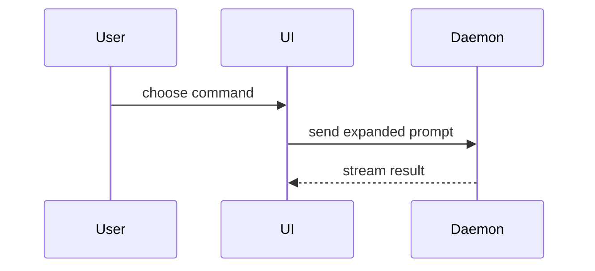

# Visual summary, evidence, and merge danger

This reference adapts the visual catalog in [mattpocock/skills `pr`](https://github.com/mattpocock/skills/blob/main/skills/in-progress/pr/SKILL.md). See [`../CREDITS.md`](../CREDITS.md) and [`../LICENSE`](../LICENSE). Use it only when a visual or a fuller evidence/risk explanation makes the PR body clearer.

## Upstream baseline

Use this body shape when it fits the repository template:

```markdown
## Summary

<diagram, diff-sketch, or tree>

## Evidence

- **Before:** <screenshot/output/failing test run>
  **After:** <screenshot/output/passing test run>

## Merge Danger

**Door:** <one-way or two-way>

<optional: description>

**Blast Radius:** <one-word description>

<optional: potential ramifications of merge>
```


## Summary

Pick the smallest view that makes the key point clear.

- Show logic or an algorithm as pseudocode:

```text
on(save)
  if content is unchanged
    return cached result
  write new content
  return fresh result
```

- Show runtime control flow as a call tree:

```text
submitForm
  createSession
    persistPrompt
    launchAgent
  navigateToSession
```

- Show UI structure as a component tree, including state and module boundaries that matter:

```tsx
<SessionPage>(apps / example / src / routes / session.tsx);
useSessionEvents() < SessionToolbar > <RunSkillButton>(packages / ui);
```

- Show file responsibility or a broad refactor as a shallow file tree:

```text
src/
├── commands/       # parses user actions
├── sessions/       # owns session state
└── transport/      # sends API requests
```

- Show component interaction, control flow, or data flow with Mermaid:



- Use `diff` when the point is what changes and the surrounding shape already exists. Match the diff shape to the topic.

For a component change:

```diff
 <SessionPage>
   useSessionEvents()
   <SessionToolbar>
+    <RunSkillButton />
   <SessionTimeline>
+    <SkillResultCard />
```

For a file-layout change:

```diff
 src/
 ├── commands/
+│   └── show-me.ts       # expands the slash command
 ├── sessions/
-└── transport.ts
+└── transport/
+    ├── client.ts
+    └── stream.ts
```

For a call-tree or call-stack change:

```diff
 submitForm
   createSession
     persistPrompt
+    expandSkillMention
     launchAgent
-  navigateToSession
+  navigateToSession
+    subscribeToEvents
```

For a state or control-flow change:

```diff
 on(save)
-  write content
+  if content is unchanged
+    return cached result
+  write new content
+  invalidate cache
```

- Show the whole block when most of it is new, when omitted context would hide ownership or order, or when the user needs a copyable target shape:

```ts
function expandSkill(command: string): string {
  const skillName = command.slice(1);
  return `use the ${skillName} skill`;
}
```

### Guidance

Place each visual next to the short text it supports. Keep only the calls, files, props, states, and boundaries needed to answer the user's current question or the options to resolve the current discussion point.

You may use one of these, you may use several, it is unlikely you will use all of them. Use your judgement and don't overwhelm the user.

## Evidence

Concrete evidence shows that the change works. Show a before and after when it reveals the behavior delta.

- Screenshots are S-tier when the environment is set up and the change is visual.
- Execution-based evidence is A-tier: test results and console output. Show the exact test that failed before and passed after, using pseudocode if necessary.
- For a non-regression change, replace a fictitious "before" with the completed command and its observed result. Never fabricate either side; use `<MISSING_EVIDENCE>` when the required proof was not completed.

```markdown
## Evidence

- **Before:** `pnpm test cache` failed: expected a fresh result after editing content.
- **After:** `pnpm test cache` passed: unchanged content returns the cached result; edited content returns a fresh result.
```

```markdown
## Evidence

- `nix eval --file tests/selector.nix` — passed.
- Integration test result: <MISSING_EVIDENCE>
```

## Merge Danger

Describe whether this is a one-way or two-way door. A two-way door can be rolled back cheaply; destructive actions and hard-to-reverse decisions are one-way doors. Blast radius is the potential impact or scope of the change: for example, consumer breakage, data loss, layout shift, or mobile responsiveness.

Keep the body concise and concrete:

```markdown
## Merge Danger

**Door:** two-way
**Blast Radius:** cache consumers

Rollback restores the prior cache behavior; callers may see one stale result until refresh.
```

```markdown
## Merge Danger

**Door:** one-way
**Blast Radius:** persisted customer data

The migration deletes legacy records; restoring code cannot reconstruct deleted values.
```

For a low-risk docs-only change, the section can remain short:

```markdown
## Merge Danger

**Door:** two-way
**Blast Radius:** documentation readers
```
