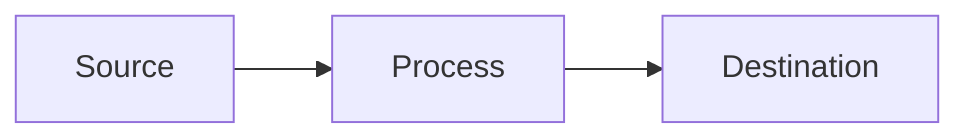

# To Arch Design

Turn the current conversation and codebase understanding into a **system architecture design document**: the engineering HOW at system level. This is the design-review artifact a reviewer reads to approve an approach — current state vs. proposed state, the decisions and their trade-offs, how the pieces fit, and what is still unresolved.

Do NOT interview the user. Synthesize what you already know from the conversation and the code. Anything you genuinely cannot resolve becomes an **Open Question**, not a blocking prompt. (If the user wants to be interviewed first, that is the separate grilling skill, not this one.)

This is the sibling of `to-spec` and `to-tickets`: `to-spec` captures the product WHAT/WHY (user stories), `to-tickets` captures the execution order (vertical slices + blocking edges), and this captures the **system HOW**. The natural chain is `to-spec` → `to-arch-design` → `to-tickets`.

## Process

### 1. Gather context

Work from whatever is already in the conversation. If the user passes a reference as an argument — a spec path, an issue number or URL, an existing design doc — fetch it and read its full body and comments before synthesizing.

### 2. Explore the codebase

If you have not already, explore the repo to ground the design in reality. You cannot write "current state vs. proposed state" without understanding the current state. Use the project's domain glossary vocabulary throughout, and respect any ADRs in the area you are touching. Read the code the proposal replaces or extends so the current-state section is accurate, not assumed.

### 3. Write the doc

Write the document using the template below. Rules:

- **Core sections are always present. Optional sections are omitted when they do not apply** — a small change does not need a COGS analysis or a multi-phase migration plan. Do not pad; omit rather than fill with filler.
- **Every unresolved decision goes in the Open Questions table** with its status and owner. Never silently assume a load-bearing decision.
- **No specific file paths or code snippets** — they go stale fast. Exception: inline a snippet only when it encodes a decision more precisely than prose can (a schema, a type shape, a config block, a state machine). Trim it to the decision-rich part, not a working demo.
- Present tense, concise, scannable. Prefer comparison tables for current-vs-proposed and for trade-offs.

### 4. Diagram with mermaid

Include **one overall-architecture mermaid diagram by default**, inline in the Architecture Overview (a `flowchart`/`graph` of the components and data flow). Mermaid is plain text and renders on common documentation sites, so a diagram costs almost nothing and a design doc without a picture is weak.

Add further mermaid diagrams (`sequenceDiagram` for interactions, deployment/component graphs) **only where a subsystem's complexity warrants one** — driven by the system, not by rote. Keep all diagrams in mermaid.

### 5. Publish

- Always write the finished doc to `to-arch-design-<slug>.md` in the current directory (slug from the doc title). This local Markdown file is the canonical artifact.
- The documentation site should have been provided to you. If it was, publish the doc there directly. If it was not, report the local file path and ask the user where they want it published — or leave it as the local file.

## Template

<arch-design-template>

# <System / change name>: Architecture

**Status:** <e.g. Draft / In review / Approved> · **Owner:** <who> · **Related:** <spec / issue / parent doc references>

## Purpose

What this system or change is, in one short section. What it does and why it exists now. If it replaces or absorbs something, say so here.

## Problem Statement

The concrete problem driving this, grounded in real signals (escalations, incidents, gaps). Why the status quo is insufficient. Where relevant, include a "why not just patch the existing thing" — the risks or blockers that rule out the smaller change.

## Goals / Non-Goals

_(Optional — omit for small changes.)_

- **Goals:** the outcomes this design must deliver.
- **Non-Goals:** what is explicitly out of scope, and deferred to when.

## Architecture Overview

### Current state

How it works today — the existing topology, data shapes, and limitations. Ground this in the actual code.

### Proposed state

How it will work. Include one mermaid overall-architecture diagram:

Walk the flow step by step (a numbered list or table of steps → components → detail reads well).

## Components & Schemas

_(Optional — include when component internals or data schemas carry design weight.)_
Per-component detail, message/event schemas, interfaces. Inline schemas or type shapes where they encode a decision.

## Error Handling

_(Optional — include for services where failure modes are a design concern.)_
A table of failure scenarios and how each is handled. Prefer designs where every path ends in "done" or a dead-letter/quarantine, never a crash and never silent loss.

## Technology Stack

_(Optional — include when technology choices are non-obvious and need justifying.)_
A table of component → choice → rationale. Rationale, not just the name.

## Key Decisions & Trade-offs

The load-bearing decisions and what each buys and costs. This is the heart of a design doc — a reviewer approves the trade-offs, not the diagram. For each: the decision, the alternatives considered, and why this one.

## Migration / Phasing

_(Optional — include for anything shipped in stages or replacing a live system.)_
A table of phase → scope → deliverable → rough timeline. State which phase delivers the primary value.

## Key Differences

_(Optional — include when replacing or superseding an existing system.)_
A table comparing the current system and the proposed one across the aspects that matter (routing, storage, deployment, error handling, extensibility, …).

## COGS / Cost

_(Optional — include when cost is a real factor in the decision.)_
Volume estimates and monthly cost breakdown. Call out where the cost concentrates.

## Open Questions

| # | Question | Status | Owner |
|---|----------|--------|-------|
| 1 | <a decision not yet resolved> | Open / In progress / Resolved | <who> |

Every genuinely-unresolved decision lands here rather than being silently assumed.

## References

- Links to the spec, parent designs, escalations, prior art, and the systems this replaces.

</arch-design-template>
